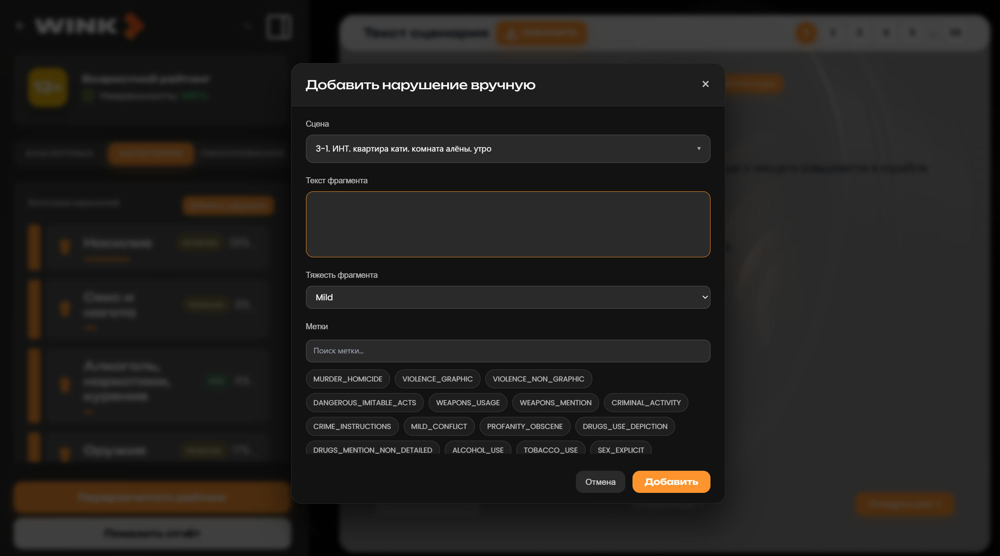
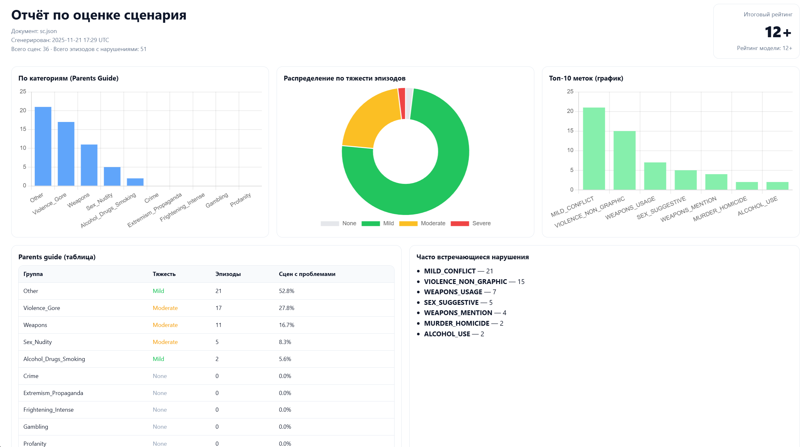

# AI Система оценки возрастного рейтинга и качества сценариев

> Быстрый, точный и прозрачный инструмент анализа сценариев для кинопроизводства и стриминговых платформ.

---

## 1. Цель проекта

Сократить время и стоимость получения корректного возрастного рейтинга и редакционной обратной связи по кино‑ и сериалным сценариям за счет:
- Автоматизации экспертной оценки (контентные риски, возрастные ограничения, проблемные эпизоды).
- Прозрачной аргументации каждого решения (обоснования, доказательные фрагменты).
- Интерактивного редактирования сценария и мгновенного пересчета рейтинга без ожидания недель ручной экспертизы.

## 2. Проблема индустрии

| Как происходит сейчас | Последствия |
|-------------------|-------------|
| Ручная экспертиза на поздних стадиях | Срыв дедлайнов, потеря оптимальных слотов производства |
| Субъективность оценки, отсутствие единых стандартов | Репутационные и юридические риски |
| Недели ожидания финального рейтинга | Удорожание переделок после съемок |
| Нет единого прозрачного инструмента | Фрагментарные процессы и дублирование усилий |

Индустрии нужен быстрый, точный и воспроизводимый механизм проверки сценариев.

## 3. Наше решение

**Ключевые принципы:**
- Не жертвуем качеством ради скорости.
- Сохраняем контекст — анализ на уровне сцен и реплик.
- Предоставляем обоснование каждой классификации.
- Мгновенная итерация: правка → пересчет рейтинга → обновленная аналитика.

**Артефакты и поток:**
1. Загрузка сценария (PDF / DOCX, до ~120 страниц).
2. 4‑стадийный интеллектуальный пайплайн.
3. Получение структурированного отчета с проблемными фрагментами, рекомендациями и финальным возрастным рейтингом.
4. Веб‑интерфейс позволяет:
   - Просматривать сцены и реплики.
   - Вносить точечные правки нарушений.
   - Пересчитывать рейтинг “в один клик”.
   - Экспортировать отчеты (HTML / PDF / DOCX).

## 4. Архитектура и технологическое ядро

### 4.1 Сегментация текста
| Зачем | Как | Результат |
|-------|-----|-----------|
| Структурированный анализ | Умный парсинг (7 кодировок), выделение сцен + реплик | Четкая структура, сохраненный контекст, точная локализация проблем |

### 4.2 Модель
- OSS 20B (MoE архитектура, 32 эксперта, активация 2.5–3B параметров).
- Harmony (расширенное “reasoning” для логической интерпретации и структурированных выводов).
- Обучение на ~2.3×10¹³ токенов: глубокое понимание контекста, сарказма, атмосферы.
- Формат GGUF: квантизация → ускорение и снижение требований к ресурсам.
- Производственная готовность: баланс скорости (в 6–8 раз быстрее Dense аналогов) и качества в классификации.

### 4.3 4‑стадийный пайплайн

| Стадия | Назначение | Ключевые эффекты |
|--------|------------|------------------|
| 0 (Prefilter / интеллектуальная фильтрация) | Отсеивание нейтральных сцен | Экономия вычислительных ресурсов на 40–60% |
| 1 (Базовая классификация) | Смысловой анализ предложений | Метки с уверенностями, без упора на ключевые слова |
| 2 (Уточнение и нормализация) | Рейтинги по меткам, локальная оценка тяжести + причины / советы | Консолидация и очистка набора нарушений |
| 3 (Финальный рейтинг + объяснение) | Подбор минимально допустимого возрастного рейтинга согласно закону | Четкое текстовое объяснение, учитывающее смягчающие факторы |

(В интерфейсе отображается как Stage0–Stage3; при необходимости возможен прямой пересчет Stage3 без повторного анализа.)

## 5. Бизнес-ценность

### Для сценаристов
- Быстрая обратная связь на стадии черновика.
- Понимание границ допустимого рейтинга.
- Творческая свобода внутри прозрачных правил.
- Экономия времени (минуты вместо недель).

### Для продюсеров
- Снижение затрат на правки 60–80%.
- Ускорение подготовки и защита производственных слотов.
- Готовая структурированная документация для внутренних комитетов.

### Для платформ / студий
- Автоматизация модерации и соответствия нормам.
- Снижение правовых рисков.
- Ускорение time‑to‑market.
- Аналитика контентных рисков (интенсивность, частота типов нарушений).

### Резюме
| Метрика | Эффект |
|---------|--------|
| Затраты на экспертизу | ↓ до 60–80% |
| Скорость получения рейтинга | Недели → Минуты |
| Риск поздних дорогостоящих правок | Снижается за счет раннего контроля |
| Прозрачность | 100%: у каждой классификации есть объяснение |

## 6. Основные функциональные требования

| Категория | Требования |
|-----------|------------|
| Загрузка | Прием PDF/DOCX сценария (до ~120 страниц), идентификация документа (doc_id), хранение исходника |
| Парсинг | Надежное разбиение на сцены/реплики, сохранение метаданных (страница, тип блока, говорящий) |
| Анализ | 4 стадии с прогресс‑ивентами (SSE), частичный вывод (partial updates), кэширование результатов и переиспользование между похожими версиями |
| Редактирование | Добавление, обновление, отмена нарушений; изменение текста реплики; отметка temp.txt для принудительного пересчета |
| Пересчет рейтинга | GET /api/rating/recalc/{doc_id} без тела; обновление итогового output.json |
| Отчеты | Генерация HTML/PDF (pdfkit + wkhtmltopdf), вывод статистик, топ меток, ключевых сцен |
| Экспорт сценария | HTML‑просмотр (структурированное отображение), вывод DOCX/PDF (опционально) |
| Кэш / ускорение | Поиск совпадений по “чистому” названию + размеру файла; игнорирование папок с temp.txt; workspace reuse |
| API | REST + SSE endpoint для основного анализа (stream), чистые GET для стадий и финального отчета |

## 7. Нефункциональные требования

| Аспект | Требования |
|--------|------------|
| Производительность | Умная фильтрация Stage 0 снижает объем последующих запросов на 40–60%; MoE модель |
| Масштабируемость | Стейт анализа отделен от логики рендеринга; кэширование повторных проверок сценария |
| Надежность | Fallbacks при импорте модели; обработка ошибок пайплайна с SSE событиями “error_start” / “error” |
| Прозрачность | Все метки имеют reason/advice; финальный рейтинг сопровождается пояснением (explanation) |
| Аудит | Дебаг‑дампы стадий (raw + parsed), сохранение промежуточных output.json |
| UX / Реактивность | Частичные обновления Stage1 (partial_stage1), фактический показ прогресса сцен/реплик |
| Интероперабельность | Форматы: JSON для API, HTML/PDF для отчетов, DOCX/PDF/HTML для экспорта текста |
| Безопасность | Никаких пользовательских команд не исполняются; пути и имена файлов нормализуются; запрет использования временных неконтролируемых директорий |
| Кеш‑инвалидаторы | temp.txt гарантирует принудительный пересчет при любой серверной правке |

## 8. Формат итогового output.json (упрощенный обзор)

```json
{
  "document": "scenario_input.json",
  "final_rating": "12+",
  "model_final_rating": "12+",
  "model_explanation": "…",
  "scenes_total": 36,
  "problem_fragments": [
    {
      "scene_index": 3,
      "sentence_index": 7,
      "text": "...",
      "labels": ["VIOLENCE_NON_GRAPHIC", "WEAPONS_USAGE"],
      "evidence_spans": {
        "VIOLENCE_NON_GRAPHIC": { "severity": "Moderate", "score": 55, "reason": "Описание драки...", "advice": "Уменьшить детализацию..." },
        "WEAPONS_USAGE": { "severity": "Mild", "score": 42, "reason": "Показ использования оружия...", "advice": "Смягчить формулировку..." }
      },
      "severity_local": "Moderate",
      "recommendations": ["Снизить интенсивность сцены"]
    }
  ],
  "parents_guide": {
    "Violence": { "severity": "Moderate", "episodes": 15, "scenes_with_issues_percent": 33.3, "examples": [ ... ] },
    "Weapons":  { "severity": "Mild", "episodes": 8, "scenes_with_issues_percent": 20.0, "examples": [ ... ] }
  },
  "processing_seconds": 74.21
}
```

## 9. API (основные эндпоинты)

| Метод | Путь | Назначение |
|-------|------|------------|
| POST | /api/scenario/upload | Загрузка сценария |
| GET  | /api/analyze/run | SSE анализ (многостадийный поток) |
| GET  | /api/stage/{doc_id}/final | Получение финального отчета |
| GET  | /api/report/{doc_id}?inline=true | Просмотр отчета (HTML/PDF) |
| GET  | /api/rating/recalc/{doc_id} | Пересчет финального рейтинга (Stage 3) |
| POST | /api/edit/violation/add/{doc_id} | Добавление нарушения |
| PUT  | /api/edit/violation/update/{doc_id} | Обновление нарушения |
| POST | /api/edit/violation/cancel/{doc_id} | Отмена нарушения |
| PATCH| /api/edit/violation/sentence/{doc_id} | Изменение текста реплики |
| POST | /api/scenario/view/{doc_id} | HTML визуализация текста сценария |
| POST | /api/scenario/export/{doc_id} | Экспорт DOCX/PDF |

## 10. Пайплайн

1. Загрузка файла → workspace/data/<doc_id>.
2. Парсер → parsed_scenes.json.
3. SSE анализ:
   - Stage0 (prefilter) → Stage1 (классификация) → Stage2 (оценка меток) → Stage3 (финальный рейтинг).
4. output.json обновляется инкрементально и кэшируется.
5. Редактирование нарушений обновляет output.json + устанавливает temp.txt (инвалидатор).
6. Повторный запуск пересчета рейтинга ← только Stage3 обновляет тот же output.json.

## 11. Ключевые преимущества

- Скорость: минуты вместо недель.
- Контекст: анализ на уровне сцен и реплик вместо слабой разметки.
- Прозрачность: наличие объяснений (reason + advice).
- Интерактивность: правки и мгновенный пересчет без ручных циклов.
- Масштабируемость: переиспользование результатов между версиями сценариев.

## 12. Скриншоты интерфейса

Загрузка сценария

Анализ

Редактирование/добавление нарушений

Отчёт


## 13. Запуск проекта

Для запуска проекта убедитесь, что установлены все зависимости для фронтенда и бэкенда.

### 1. Фронтенд

Перейдите в директорию фронта и запустите dev-сервер:

```bash
cd front-main
npm run dev
```

После старта вы сможете открыть фронтенд в браузере по адресу, указанному в консоли

---

### 2. Бэкенд

В отдельном терминале перейдите в директорию бэкенда и запустите сервер:

```bash
cd back
uvicorn backend.main:app --reload
```

По умолчанию Uvicorn поднимает сервер по адресу:

```text
http://127.0.0.1:8000
```

После запуска обоих сервисов фронтенд будет взаимодействовать с бэкендом по настроенным эндпоинтам.


## Сборка и запуск через Docker
Перейдите в папку с файлом `docker-compose.yml` и выполните команды:
```bash
docker compose build
```

```bash
docker compose up
```


> Использование модели для оценки возрастного рейтинга не заменяет финальную юридическую экспертизу. Проект предоставляет инструмент предварительной аналитики и оптимизации производственного процесса.
